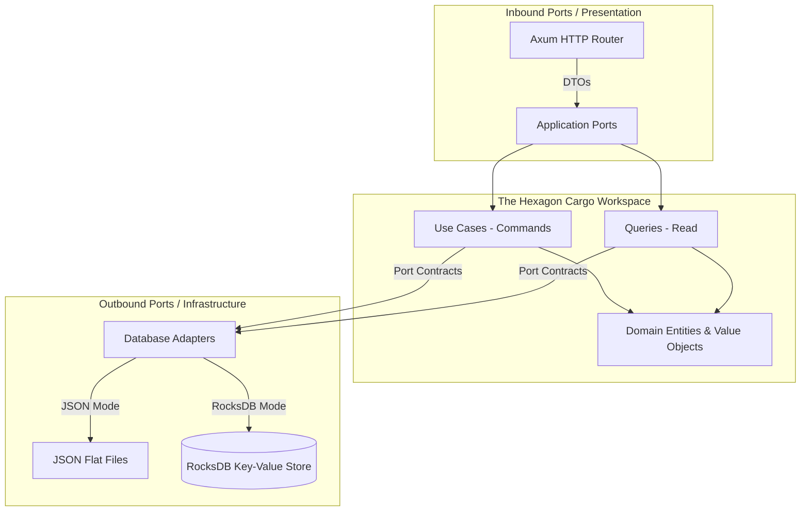

# Rust Ledger (Hexagonal Architecture & CQRS)

This is an asynchronous, high-performance **Financial Ledger** (Bookkeeping) service developed in Rust, strictly following the principles of **Hexagonal Architecture (Ports & Adapters)** and **CQRS**.

The project uses a modular workspace design, dividing the system's responsibilities into multiple local crates within a Cargo Workspace.

---

## 🏛️ Architectural Design

This project strictly separates its core business rules (Core) from any external delivery mechanisms (such as HTTP servers or database engines).



### 1. CQRS Separation
- **Commands (Write)**: Focused on operations that modify the state of the ledger. Represented by the [`TransferUseCase`](file:///home/syobon/files/programming/projects/rust/rust-ledger/application/src/use_cases/transfer.rs). Executed double-entry balancing validations and ensures idempotency.
- **Queries (Read)**: Optimized for read/fetch operations. Represented by [`GetBalanceQuery`](file:///home/syobon/files/programming/projects/rust/rust-ledger/application/src/queries/get_balance.rs) and [`GetStatementQuery`](file:///home/syobon/files/programming/projects/rust/rust-ledger/application/src/queries/get_statement.rs).

### 2. Crate Decomposition (Cargo Workspace)
- **`domain`**: Domain entities (`Transaction`, `EntryLine`), Value Objects (`AccountId`, `TransactionId`), and mathematical/business validation rules.
- **`application`**: Orchestrating use cases, query dispatchers, and trait signatures (Ports) that infrastructure adapters must implement (`LedgerRepository`, `BalanceQueryRepository`, `StatementQueryRepository`).
- **`infrastructure`**: Concrete database/storage adapters:
  - **`JsonLedgerRepo`**: Simplistic persistence using custom flat JSON files.
  - **`RocksDbLedgerRepo`**: High-performance key-value persistence utilizing an embedded **RocksDB** engine, coupled with an in-memory lock manager per account (`DashMap` + `tokio::sync::Mutex`) to guarantee concurrency safety.
- **`presentation`**: Inbound HTTP adapter running an **Axum** web router featuring request body parsing, error handling, and graceful shutdown listening.
- **`src` (Binary/Runner)**: Boots telemetry (`tracing`), parses env variables (`dotenvy`), configures and injects dependencies, and starts the Axum server.

---

## 🚀 Quick Start

### 1. Prerequisites
- Rust toolchain (MSRV 1.75+)
- **k6** CLI (if you want to run stress tests)

### 2. Configure Environment Variables
Copy the template `.env` file:
```bash
cp .env.example .env
```
Supported variables:
* `SAVE_MODE`: sets the storage engine (`json` or `rocksdb`). Defaults to `json`.
* `RUST_LOG`: controls logging level (e.g., `info,rust_ledger=debug`).

### 3. Compile and Run the Application
Run the server in development or production/release mode:
```bash
cargo run --release
```
The server will start listening for HTTP connections on port `3000`.

---

## 🧪 Automated Tests

To run the automated unit test suite across the domain and application workspace crates:

```bash
cargo test
```

---

## ⚡ Stress Testing (k6)

The [`http/k6/`](file:///home/syobon/files/programming/projects/rust/rust-ledger/http/k6/) directory contains a load-testing script to simulate high concurrency of users sending concurrent transfer, balance, and transaction statement requests:

To run the stress test:
```bash
k6 run http/k6/k6_stress.js
```
The test results and scores will be stored locally in `http/k6/summary.txt` (which are ignored by Git).
